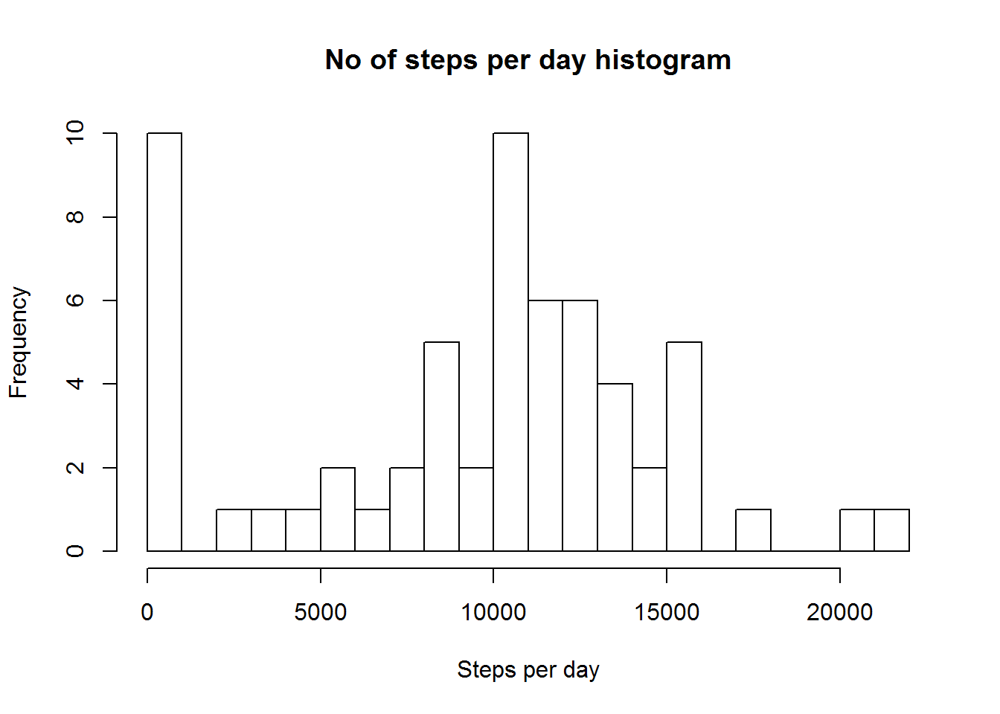
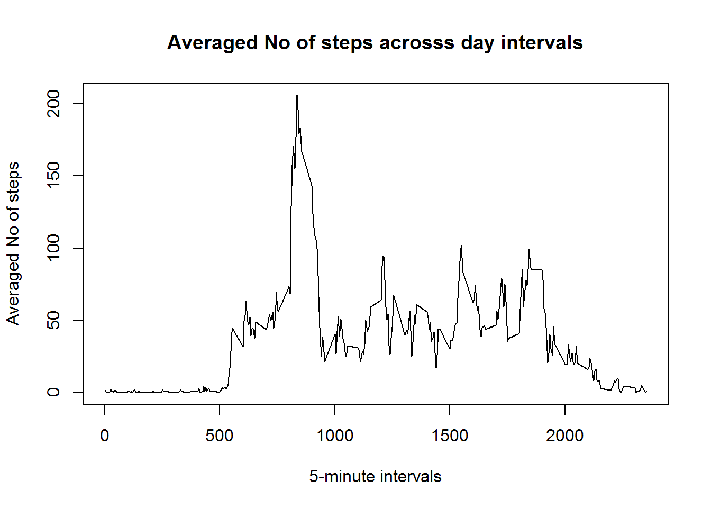
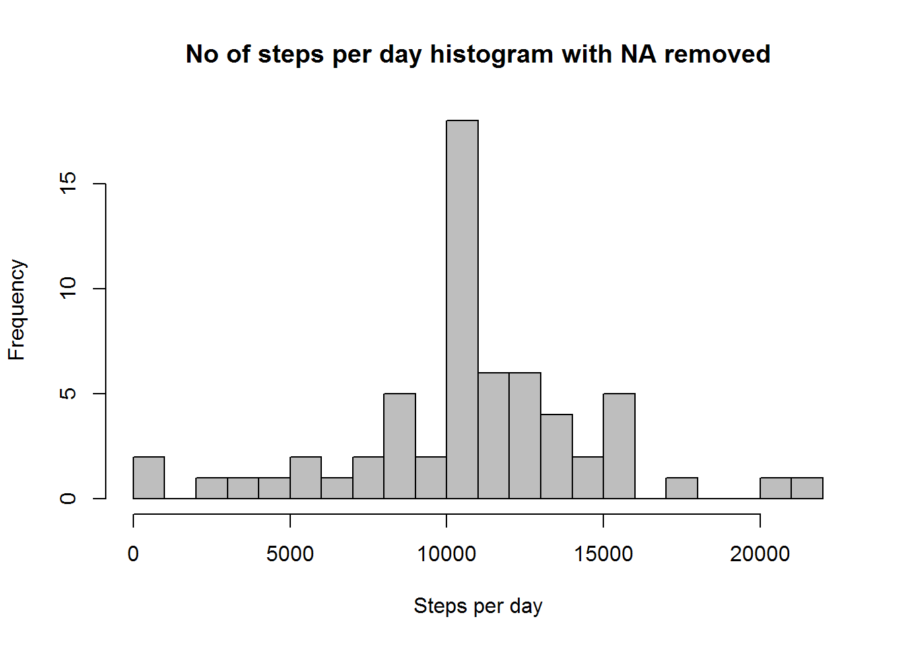
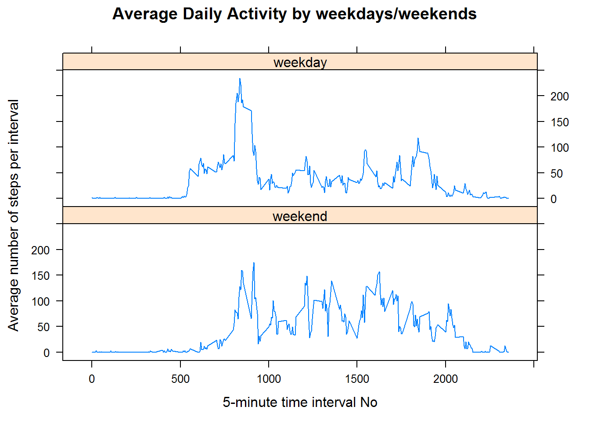

## Loading and preprocessing the data

Code for loading file from URL given in an assignment.

```r
getsets <- function(furl = '') {
    library(downloader)
    zipfile <- 'dfile.zip'
    download(fileurl, dest = zipfile, mode = 'wb')
    unzip(zipfile)
    unlink(zipfile)
}

fileurl <- 'https://d396qusza40orc.cloudfront.net/repdata%2Fdata%2Factivity.zip'
getsets(fileurl)
```

Code for reading data into data frame and preprocessing 'date' field.

```r
activity <- read.csv('activity.csv', stringsAsFactors = FALSE)
activity$date <- as.Date(activity$date)
```


## What is mean total number of steps taken per day?

In order to calculate total number of steps per day one needs to summarize steps by
dates. I used summarize() function from DPLYR package for this task. Code below includes grouping data by dates and plotting a histogram to make a glance on distribution.

```r
library(dplyr)
activity.d<- activity %>%
    group_by(date) %>%
    summarize(totsteps=sum(steps, na.rm=TRUE))
```

```r
hist(activity.d$totsteps, main = 'No of steps per day histogram', xlab = 'Steps per day', breaks = 20)
```



As for mean and median values for *steps* taken per day, they are as follows:
**mean**    = 9354.23
**median**  = 10395

Here is the code for computing those values:

```r
mean(activity.d$totsteps, na.rm = TRUE)
```

```
## [1] 9354.23
```

```r
median(activity.d$totsteps, na.rm = TRUE)
```

```
## [1] 10395
```

## What is the average daily activity pattern?

At first we need to average steps by intervals across all dates in a dataset. Then we have to create a vector with unique values of time intervals. Used the following code for it:

```r
stepints <- tapply(activity$steps, activity$interval, FUN = mean, na.rm = TRUE)
intervals <- unique(activity$interval)
```

Once we have a vector with averaged No of steps and a vector with unique time intervals we can plot averaged No of steps across day intervals in order to visually determine an interval with biggest average steps number. Code for plotting:


```r
plot(intervals, stepints, type = 'l', 
     main = 'Averaged No of steps acrosss day intervals', 
     xlab  = '5-minute intervals', ylab = 'Averaged No of steps')
```



As seen from the plot maximum No of steps happens at about 800-900 time intervals. Exact time interval is **835** as one can see from the following code:

```r
intervals[which.max(stepints)]
```

```
## [1] 835
```

## Imputing missing values

There are **2304** rows with missing values total. All missing values are in 'steps' column. It can be seen from the following code:

```r
sum(is.na(activity))
```

```
## [1] 2304
```

```r
sum(is.na(activity$steps))
```

```
## [1] 2304
```

Now we'll modify our dataset by imputing NA values. I chose to replace **NA**s with means for that 5-minutes interval. The code is as follows:

```r
activity.noNA<- activity %>%
    group_by(interval)  %>%
    mutate(steps= ifelse(is.na(steps), mean(steps, na.rm=TRUE), steps))
activity.noNA<- activity.noNA %>%
    group_by(date) %>%
    summarize(totsteps=sum(steps, na.rm=TRUE))
```

And a histogram for a dataset with imputed NA steps:

```r
hist(activity.noNA$totsteps, main = 'No of steps per day histogram with NA removed', 
     xlab = 'Steps per day', breaks = 20, col = 'gray')
```



Now let see how **mean** and **median** values changed after imputing NA values. New values are:
**mean**    = 10766.19
**median**  = 10766.19

Here is a code:

```r
mean(activity.noNA$totsteps)
```

```
## [1] 10766.19
```

```r
median(activity.noNA$totsteps)
```

```
## [1] 10766.19
```

The impact of imputing missing data is that new dataset is smoother and closer to normal distribution.

## Are there differences in activity patterns between weekdays and weekends?

First we'll create a factor column 'wday' in a dataset and fill it with apptopriate values depending on 'date' field.

```r
activity$day <- weekdays(activity$date)
wdays <- c('Monday', 'Tuesday', 'Wednesday', 'Thursday', 'Friday')
activity$wday <- factor((weekdays(activity$date) %in% wdays), 
                        levels = c(FALSE, TRUE), labels = c('weekend', 'weekday'))
```

Then we'll create a new dataset with data averaged by 'wday'.

```r
activity.dtype <- activity %>% 
                    group_by(wday, interval) %>% 
                        summarize(totsteps = sum(steps, na.rm = TRUE), 
                                  avsteps = mean(steps, na.rm = TRUE))
```

And finally we'll plot the data.

```r
library(lattice)
xyplot(avsteps~interval|wday, 
       data=activity.dtype, type='l', layout=(c(1,2)), 
       main="Average Daily Activity by weekdays/weekends", 
       ylab="Average number of steps per interval", 
       xlab="5-minute time interval No")
```



As seen from the plots weekend activity is more uniformely distributed across the day and has lower local peaks.
